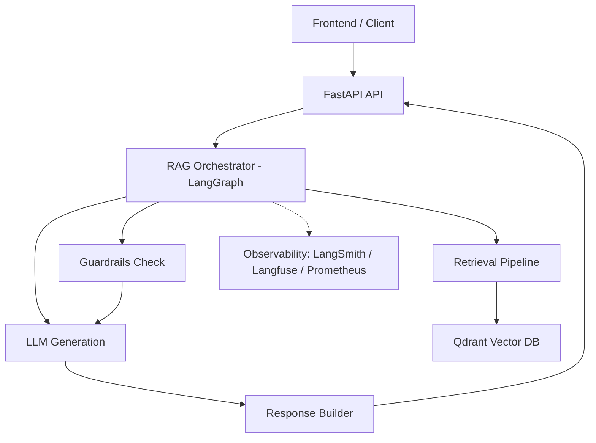
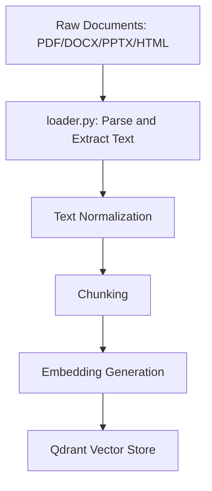
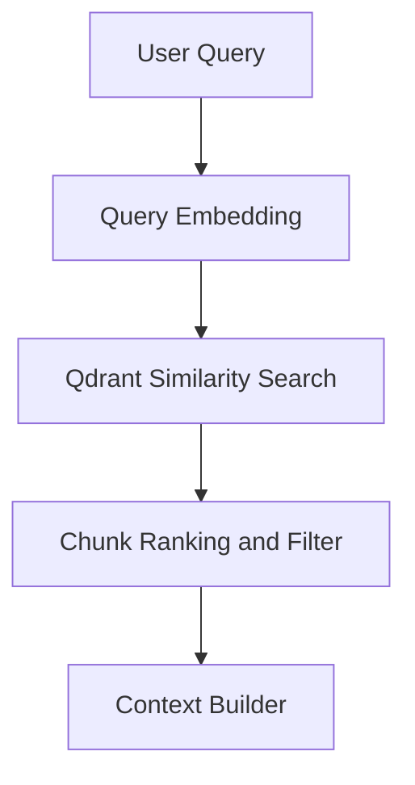
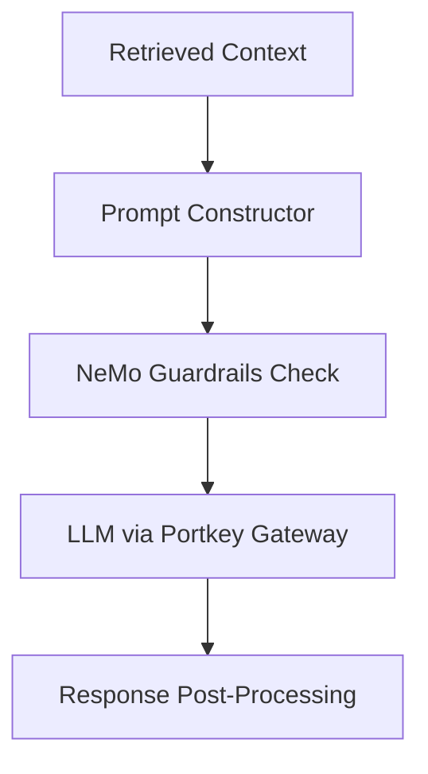
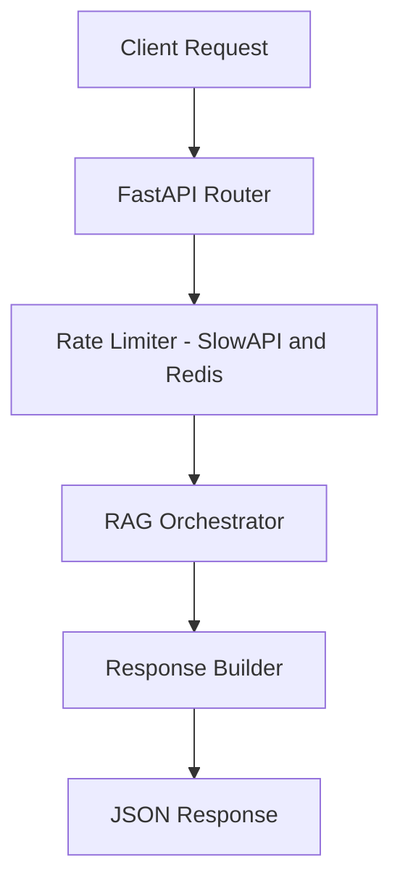

# 🏗️ Enterprise-Grade Agentic RAG Application


A modular, production-style Agentic RAG (Retrieval-Augmented Generation) system — built and documented step by step, from document ingestion through guardrailed LLM generation, served via FastAPI.

## 📑 Table of Contents
- [🏗️ Enterprise-Grade Agentic RAG Application](#️-enterprise-grade-agentic-rag-application)
  - [📑 Table of Contents](#-table-of-contents)
  - [📘 Overview](#-overview)
  - [⚙️ Tech Stack](#️-tech-stack)
  - [📂 Project Structure](#-project-structure)
  - [🏛️ Architecture](#️-architecture)
    - [Full System Architecture](#full-system-architecture)
    - [Ingestion Pipeline](#ingestion-pipeline)
    - [Retrieval Pipeline](#retrieval-pipeline)
    - [Generation Pipeline](#generation-pipeline)
    - [FastAPI Backend Flow](#fastapi-backend-flow)
  - [🚀 Getting Started](#-getting-started)
    - [1. Clone the repository](#1-clone-the-repository)
    - [2. Create and activate a virtual environment](#2-create-and-activate-a-virtual-environment)
    - [3. Install dependencies](#3-install-dependencies)
    - [4. Configure environment variables](#4-configure-environment-variables)
    - [5. Run the FastAPI server](#5-run-the-fastapi-server)
  - [📡 API Usage](#-api-usage)
    - [Health check](#health-check)
    - [Query endpoint](#query-endpoint)
  - [🧠 Features](#-features)
  - [🗺️ Roadmap](#️-roadmap)
    - [✅ Completed](#-completed)
    - [🔜 In Progress](#-in-progress)
    - [🚀 Planned Enhancements](#-planned-enhancements)
  - [🤝 Contributing](#-contributing)
  - [📄 License](#-license)

## 📘 Overview

This repository documents the build of an **agentic RAG application**, from raw documents to a guardrailed, observable question-answering API. Each stage — ingestion, embedding, vector storage, retrieval, generation, and safety guardrails — is built and committed as a separate, testable step, so the commit history itself doubles as a build log.

The aim is a working reference implementation: every component described below has real code behind it in this repo, tracked against the [Roadmap](#-roadmap) below.

## ⚙️ Tech Stack

| Layer | Tools |
|---|---|
| API | FastAPI, Uvicorn |
| Orchestration | LangChain, LangGraph |
| Vector DB | Qdrant |
| Embeddings | Sentence-Transformers (local fallback) |
| LLM Gateway | Portkey |
| Guardrails | NVIDIA NeMo Guardrails |
| Observability | LangSmith, Langfuse, Prometheus, Logfire |
| Persistence | PostgreSQL (LangGraph checkpointing), Redis (rate limiting) |
| Evaluation | RAGAS, DeepEval |
| Dev tooling | Ruff |

## 📂 Project Structure

```
enterprise-grade-rag-app/
├── src/
│   ├── app.py                # FastAPI application entrypoint
│   ├── ingestion/
│   │   └── loader.py          # Document loading & chunking
│   ├── embeddings/
│   │   └── embedder.py        # Embedding generation
│   ├── vectorstore/
│   │   └── store.py           # Qdrant index build/query
│   ├── retrieval/
│   │   └── retriever.py       # Query -> relevant chunks
│   ├── generation/
│   │   └── generator.py       # Prompt building + LLM call + guardrails
│   └── utils/
│       └── config.py          # Settings, env loading
├── tests/
├── docs/
├── .env.example
├── .gitignore
├── LICENSE
├── requirements.txt
└── README.md
```

## 🏛️ Architecture

### Full System Architecture



### Ingestion Pipeline



### Retrieval Pipeline



### Generation Pipeline



### FastAPI Backend Flow



## 🚀 Getting Started

### 1. Clone the repository
```bash
git clone https://github.com/DATA-Meta/enterprise-grade-rag-app.git
cd enterprise-grade-rag-app
```

### 2. Create and activate a virtual environment
```bash
python -m venv .venv
source .venv/bin/activate    # Linux/Mac
.venv\Scripts\activate       # Windows
```

### 3. Install dependencies
```bash
pip install -r requirements.txt
```

### 4. Configure environment variables
```bash
cp .env.example .env
# fill in your API keys and connection strings in .env
```

### 5. Run the FastAPI server
```bash
uvicorn src.app:app --reload
```

## 📡 API Usage

### Health check
```bash
curl http://127.0.0.1:8000/health
```

### Query endpoint
```bash
curl -X POST "http://127.0.0.1:8000/query" \
     -H "Content-Type: application/json" \
     -d '{"question": "What is RAG?"}'
```

## 🧠 Features

- Modular pipeline — each stage independently testable
- Qdrant-backed vector search
- Guardrailed generation via NeMo Guardrails
- Unified LLM routing via Portkey Gateway
- Full observability: tracing, metrics, and live monitoring
- Rate-limited, production-shaped FastAPI backend

## 🗺️ Roadmap

### ✅ Completed
- [x] Repo scaffold + professional structure
- [x] Config loader (`src/utils/config.py`)
- [x] Document ingestion + chunking
- [x] Embedding generation (Jina API + local fallback)
- [x] Qdrant vector store
- [x] Retrieval pipeline
- [x] Guardrails (rule-based layer)
- [x] LLM generation via Portkey (Groq)
- [x] FastAPI endpoints wired end-to-end
- [x] Reranking (Jina Reranker)
- - [x] Multi-format ingestion (.docx, .pptx, .html)

### 🔜 In Progress
- [ ] Unit tests (pytest)
- [ ] GitHub Actions CI

### 🚀 Planned Enhancements
- [ ] LLM-based guardrails layer (NeMo Guardrails, topical/jailbreak detection)
- [ ] Observability (LangSmith / Langfuse / Prometheus)
- [ ] Evaluation suite (RAGAS / DeepEval)
- [ ] Streamlit frontend UI

## 🤝 Contributing

Pull requests are welcome. Please open an issue first to discuss major changes.

## 📄 License

This project is licensed under the MIT License — see the [LICENSE](LICENSE) file for details.